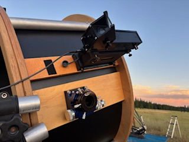

# eFinder

Project to share eFinder STL files for the eFinder project https://github.com/AstroKeith/eFinder_Lite

Included are the STL files, and the FreeCAD files for easier editing.
For the top Telrad base, I used https://www.thingiverse.com/thing:2989554

The case was designed to use threaded inserts. 4mm for the Telrad bases, 3mm for case screws, and all others are 2.5mm.  In addition the USB panel mount used with the case is https://www.amazon.com/dp/B08RSGYV1S?ref_=ppx_hzsearch_conn_dt_b_fed_asin_title_1&th=1

